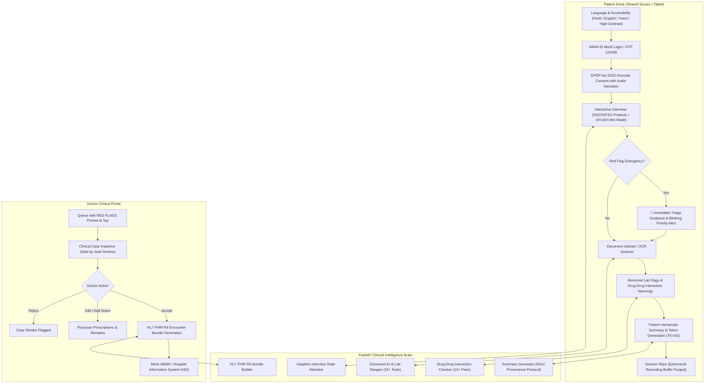

# MediKiosk (मेडीकियोस्क)
### Autonomous AI Patient Case-Taking Kiosk & Doctor Triage Portal
**Smart India Hackathon (SIH 2026) | Problem Statement SIH26047**  
**Ministry of Ayush | All India Institute of Ayurveda (AIIA)**  
*Theme: MedTech / BioTech / HealthTech | Category: Software*

---

## 1. Executive Summary

In high-volume public hospitals across India (handling over 5,000 OPD patients daily), doctors often have less than 2 to 3 minutes per patient. Vital clinical history (prior medications, past allergies, chronic conditions, and onset patterns) is frequently missed, and critical emergencies (such as acute coronary syndrome) wait in general queues alongside non-urgent cases.

**MediKiosk** solves this problem by providing a touch- and voice-enabled patient case-taking kiosk:
1. **Multilingual Voice & Tactile Intake**: Patients speak or tap in Hindi or English (SOCRATES clinical protocol).
2. **Real-time Emergency Red-Flag Triage**: Immediately detects acute life-threatening symptoms (e.g. chest pain with cold sweating) and routes patients to the triage desk while raising priority alerts for doctors.
3. **Document AI & Clinical OCR**: Reads old prescriptions and lab reports, marks abnormal lab values across 15+ reference ranges, and alerts on hazardous drug-drug interactions (e.g. Warfarin + Aspirin).
4. **Physician Summary Draft with Strict Provenance**: The AI only drafts; it *never* diagnoses. Every finding is explicitly tagged `[Patient Stated]` or `[From Document]`. The doctor can **Accept**, **Edit**, or **Reject**.
5. **ABDM / FHIR R4 Integration**: One-click generation of HL7 FHIR R4 Bundles (`Patient`, `Condition`, `MedicationStatement`, `Observation`, `AllergyIntolerance`) pushed to the mock hospital HIS.
6. **DPDP Act 2023 Compliance**: Granular revocable consent, at-rest document encryption (AES-256 Fernet), and automatic ephemeral session wiping.

---

## 2. System Architecture



---

## 3. Technology Stack

| Layer | Technology | Rationale |
|---|---|---|
| **Backend** | Python 3.14 + FastAPI + Uvicorn | High concurrency, native async I/O, fast data parsing |
| **Database** | SQLite + Row Factory | Zero-config, embeddable, reproducible in hackathon demos |
| **Clinical Brain & Triage** | Rule-controlled SOCRATES state machine + keyword speech intent parser | Predictable, auditable, safe (zero LLM hallucinations during triage) |
| **Document AI** | Schema extraction + 15 Lab reference tables + 10 Drug-Drug interaction rules | Instant identification of critical abnormalities (HbA1c, Creatinine, Warfarin+Aspirin) |
| **Security & Privacy** | AES-256 Fernet encryption at rest + bcrypt + JWT + Session Wipe | Aligned with India's Digital Personal Data Protection (DPDP) Act 2023 |
| **Interoperability** | HL7 FHIR R4 Standard (ABDM-ready) | Interoperable across Ayushman Bharat Health Accounts and hospital systems |
| **Frontend** | Modern Responsive SPA + Tailwind CSS + Lucide Icons | Touch-screen friendly, high-contrast mode, extra-large text, zero build-step fragility |
| **Voice Interface** | Browser Web Speech API (`webkitSpeechRecognition` & `SpeechSynthesis`) | Native bilingual speech input and audio narration in Hindi and English |

---

## 4. Key Clinical Features

### A. SOCRATES Protocol for Chief Complaints
- **Chest Pain**: Site (substernal), Onset, Character (crushing/tight), Radiation (left arm/jaw), Associated symptoms (cold sweating/breathlessness), Time course, Exacerbating/relieving, Severity (1-10).
- **Fever**: Duration, chills/rigor, rash, cough, altered consciousness.
- **Headache**: Thunderclap peak, meningeal neck stiffness, focal neurological deficits (FAST stroke markers).

### B. AYUSH Mini-Mode (All India Institute of Ayurveda)
- **Prakriti**: Vata / Pitta / Kapha constitution indicators.
- **Agni**: Samagni, Vishamagni, Tikshnagni, Mandagni assessment.
- **Koshtha**: Krura, Madhyama, Mridu bowel tendencies.
- **Ahara-Vihara & Nidana**: Late-night work (`ratri jagarana`), mental stress (`manasika chinta`), dietary habits.

### C. Clinical Document AI & Drug Interactions
- **15+ Lab Reference Ranges**: Automatically tags `[HIGH]` or `[LOW]` for HbA1c, Fasting Blood Sugar, Serum Creatinine, Hemoglobin, Total Cholesterol, Liver enzymes, TSH, and Electrolytes.
- **Drug-Drug Interactions**: Catches lethal combinations including:
  * Warfarin + Aspirin (Major hemorrhage risk)
  * Sildenafil + Nitroglycerin (Fatal refractory hypotension)
  * Metformin + Radiocontrast (Lactic acidosis)
  * ACE-inhibitors + Spironolactone (Hyperkalemia)

---

## 5. Quickstart & Installation

### Prerequisites
- Python 3.10+ (Tested on Python 3.14)
- Modern web browser (Google Chrome or Chromium recommended for Web Speech API)

### 1. Launch the Server
```bash
cd /home/nish/.gemini/antigravity/scratch/medikiosk
./run.sh
```

Or using python directly:
```bash
/home/nish/.gemini/antigravity/scratch/venv/bin/uvicorn backend.app.main:app --host 0.0.0.0 --port 8000 --reload
```

### 2. Access the Applications
- **Patient Kiosk**: [http://localhost:8000](http://localhost:8000)
- **Doctor Clinical Portal**: [http://localhost:8000#doctor](http://localhost:8000) (Click "Doctor Portal" tab)
- **Interactive Swagger API Documentation**: [http://localhost:8000/docs](http://localhost:8000/docs)

---

## 6. Running the Automated Test Suite

Run the full end-to-end test suite verifying health check, ABHA authentication, SOCRATES interview, red flags, lab ranges, drug interactions, and FHIR export:

```bash
/home/nish/.gemini/antigravity/scratch/venv/bin/python3 tests/run_tests.py
```

Output:
```
Database successfully seeded with realistic multi-lingual clinic demo data.
test_01_health_check ... ok
test_02_mock_abha_login ... ok
test_03_dpdp_consent ... ok
test_04_interview_flow_and_red_flag ... ok
test_05_abnormal_lab_detection ... ok
test_06_drug_interaction_detection ... ok
test_07_doctor_queue_red_flag_priority ... ok
test_08_summary_doctor_review_and_fhir_push ... ok
test_09_dpdp_session_wipe ... ok

Ran 9 tests in 0.891s
OK
```

---

## 7. 5-Minute Hackathon Demo Script

1. **Step 1: Patient Kiosk & Language Selection**:
   - Open [http://localhost:8000](http://localhost:8000). Click `हिन्दी (Hindi)` or click **"1-Click Live Demo: Chest Pain (Red Flag)"**.
2. **Step 2: DPDP Act Consent with Voice Narration**:
   - Tap **"Listen (सुनें)"** to hear the audio narration explaining consent.
   - Click **"I Consent & Continue"**.
3. **Step 3: Voice / Touch Case-Taking**:
   - Click the **Microphone** or tap **"सीने में दर्द या भारीपन"**.
   - Tap the speaker icon to listen to the question read aloud in Hindi.
   - Tap **"ठंडा पसीना छूटना" (Cold Sweating)** + **"बाईं बांह या कंधा" (Left Arm)**.
   - Notice the **Red-Flag Emergency Alert Banner** instantly trigger on screen, directing the patient to the triage desk!
4. **Step 4: Document AI & Drug Interaction Alert**:
   - Click **"Cardiology Rx"** under Preloaded Demo Documents.
   - MediKiosk extracts the medications and fires the **"DRUG INTERACTION: Warfarin + Aspirin"** warning.
   - Click **"Biochemistry Report"** -> Notice HbA1c 8.6% and Creatinine 1.8 highlighted with `[HIGH]` tags.
5. **Step 5: Token Generation & Privacy Wipe**:
   - Click **"Review & Confirm Case"**.
   - View the generated token: **TK-042** (Priority: EMERGENCY RED FLAG).
   - Click **"Complete & Print Token (Wipe Session)"** to demonstrate DPDP session memory wipe.
6. **Step 6: Doctor Clinical Portal & FHIR Push**:
   - Switch to **"Doctor Portal"**.
   - Note that **Smt. Shanti Devi (TK-042)** is pinned strictly at the **TOP OF THE QUEUE** with a blinking red badge.
   - Review the structured summary with explicit `[Patient Stated]` and `[From Document]` provenance tags.
   - Click **"Accept Draft"**, then click **"Export & Push to ABDM / HIS"**.
   - Inspect the standards-compliant **HL7 FHIR R4 JSON Bundle** ready for exchange with ABDM.

---

## 8. Hackathon Evaluation & Judge Q&A

| Question | Evaluation Defense |
|---|---|
| **How is patient privacy protected under DPDP Act 2023?** | Consent is gathered first, is granular, auditable, and revocable at any time. Raw audio recordings and ephemeral transcripts are immediately wiped on submission. Documents are encrypted with AES-256 at rest. |
| **How do you ensure clinical safety and avoid hallucination?** | The AI only drafts; it **never diagnoses**. Every finding is tagged with strict data provenance (`[Patient Stated]` vs `[From Document]`). The physician has full oversight to Accept, Edit, or Reject before anything enters the medical record. |
| **How does this scale to 5,000+ daily OPD patients?** | The question flow is governed by deterministic medical decision trees (SOCRATES) rather than unconstrained LLM loops, ensuring sub-50ms response times, zero token billing runaway, and consistent clinical rigor. |
| **Why a kiosk rather than a mobile app?** | Over 60% of rural and elderly patients in government hospitals do not have smartphones or digital health literacy. A shared hospital kiosk with large touch cards and voice narration empowers any patient to check in independently. |
| **How does AYUSH integrate with modern medicine?** | MediKiosk supports dual-mode case taking, recording Allopathic symptoms alongside Ayurvedic concepts (Prakriti, Agni, Koshtha, Ahara-Vihara), creating an integrative health record. |
